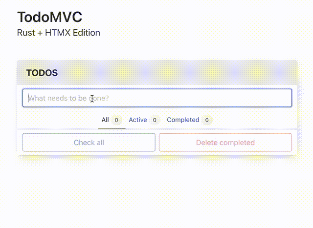

# TodoMVC: Rust + HTMX Edition

Simple [todo app](https://todomvc.com/) built using a combination of the following technologies:

- For the backend, we've used Rust along with [Axum](https://github.com/tokio-rs/axum).
- The SSR (Server-Side Rendering) components are powered by [Dioxus](https://github.com/DioxusLabs/dioxus).
- The user interface (UI) is designed with [HTMX](https://htmx.org).
- Styling and layout are crafted using the [Bulma](https://bulma.io) CSS framework.

## Features at a Glance

### No todos
- When you haven't added any todos, the counters show zero and the buttons are disabled.

### Adding new todos
- To add a new task, simply type it into the input field at the top. The input field is automatically focused when you open the app.
- Press the Enter key to create a new todo, which will be added to your list. The input field will then be cleared and ready for your next task.

### Marking all as complete
- The "Mark All as Complete" button allows you to mark or unmark all todos with a single click.
- The button also responds dynamically as you check or uncheck individual todo items.
- If there are no todos, the button is disabled to avoid confusion.

### Managing individual todos
Each todo item has several convenient actions:

1. **Check**: Click the checkbox to mark a task as complete or incomplete. This updates the status of the task.
2. **Edit**: Edit the title of a todo by double-clicking on it.
3. **Delete**: Remove a task by clicking the delete button.

### Editing individual todos
- Double-clicking on a todo to edit it triggers an editing mode. The todo title becomes an editable input field.
- Just press Enter to save your changes and exit the editing mode.

### State counters
- The counters display the number of todos in different states.

### Cleaning up completed tasks
- The "Clear Completed" button removes the completed todos.
- When no completed todos are present, the button is disabled to prevent confusion.

### Data persistence
- The todos are stored in the server's memory. Restarting the server will erase the data. 

